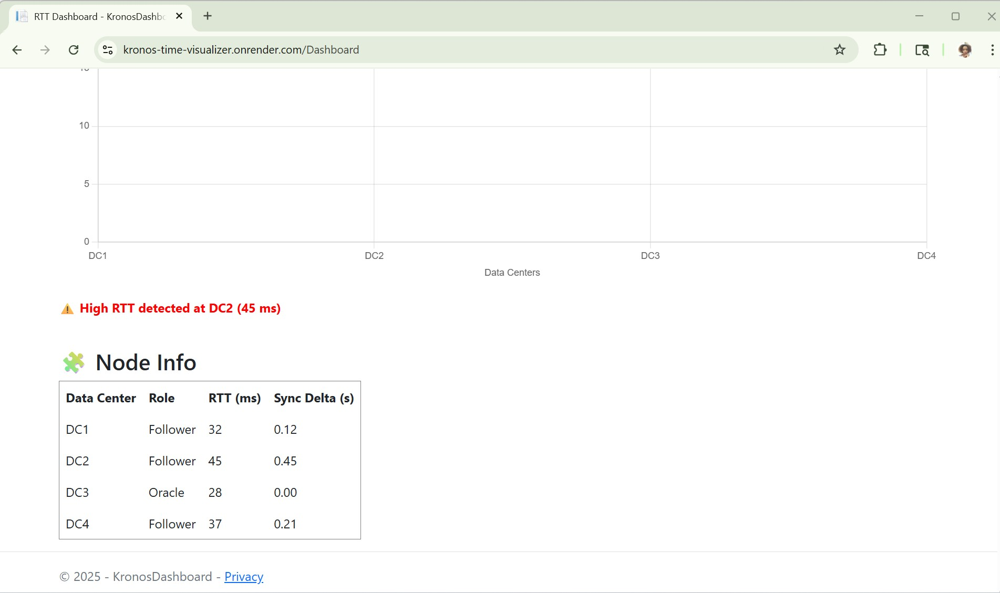

# Kronos Time Visualizer ⏱📊

**Live Dashboard:**
🌐 [https://kronos-time-visualizer.onrender.com/Dashboard](https://kronos-time-visualizer.onrender.com/Dashboard)

**GitHub Repo:**
🔗 [https://github.com/nwalablessing/kronos-time-visualizer](https://github.com/nwalablessing/kronos-time-visualizer)

---

## 🚀 About This Project

This is a personal contribution and enhancement to [Rubrik’s Kronos](https://github.com/rubrikinc/kronos), a robust distributed time synchronization system. While Kronos offers a solid backend for measuring round-trip times (RTTs) and ensuring clock consistency across distributed systems, I saw a missing piece — a human-friendly, live web interface. It lacked the kind of visual component that could make its powerful insights immediately clear, actionable, and accessible for engineers, SREs, and decision-makers in real time.

I built this **live dashboard** as a frontend window into the heart of Kronos — so engineers, DevOps teams, and learners can **see, explore, and understand** RTT (Round Trip Time) behaviors in real-time without digging through logs or running commands manually.

This dashboard adds:

* ✅ **Live-hosted visibility** for Kronos metrics
* 📈 **Real-time charts** of RTT values
* 📋 **Sync Delta summaries** between Oracle and Followers
* ⚠️ **Drift alerts** when RTTs exceed thresholds
* 💻 A clean and simple UI hosted on Render

---

## 🎯 My Motivation

I'm passionate about making complex systems more transparent. Distributed systems are everywhere — but their internals often feel like a black box. Tools like Kronos are powerful, but their usability depends on **how observably they speak** to the people who run them.

So I asked:

> *What if we could “see” Kronos working? What if latency spikes and sync drift were right in front of us, beautifully visualized and accessible from anywhere?*

This dashboard is the answer. It's a reflection of my curiosity, my love for clear engineering, and my belief that good tools should speak human.

---

## 🧰 Tech Stack & Tools Used

| Tool                       | Role / Purpose                                      |
| -------------------------- | --------------------------------------------------- |
| **ASP.NET Core (C#)**      | Web server, API backend, MVC logic                  |
| **Chart.js**               | Interactive, real-time RTT graph                    |
| **JavaScript (Fetch API)** | Pulling RTT and alert data dynamically              |
| **Docker**                 | Seamless deployment via container                   |
| **Render.com**             | Hosting the dashboard online                        |
| **GitHub**                 | Source control and project publishing               |
| **Visual Studio 2022**     | Full .NET IDE used for implementation and debugging |

---

## 🌟 Features

* 📊 **Live RTT Chart**: View round-trip latency across nodes
* ⚠️ **Drift Alerts**: Visibly highlights when RTT > 40ms
* 🧠 **Sync Delta Display**: See how closely followers track the Oracle
* 📋 **Node Info Table**: Includes Data Center, Role, RTT, and Delta
* 🧪 **Fully deployed**: No need to clone or build — just visit the link!

---

## 📷 Screenshots

| Chart View | Node Table |
|------------|------------|

## 📸 Screenshots

### 🔧 Dashboard Chart View  
### Full Dashboard

### Node Table + Alerts

---
---

### 🌐 Deployed Live on Render

🌐 [https://kronos-time-visualizer.onrender.com/Dashboard](https://kronos-time-visualizer.onrender.com/Dashboard)

## 🤝 Contribution & Purpose

This dashboard isn't just a project — it's my personal effort to **make infrastructure insights easier to understand and share**. In a world where time accuracy powers everything from databases to global transactions, this tool ensures **you see what's happening when it matters most**.

It adds value to Kronos by:

* Making performance metrics **instantly accessible**
* Supporting **incident response** through visual RTT anomaly detection
* Empowering new users to understand Kronos faster
* Enabling **real-time validation of system health** across deployments

I believe contributions like this help open-source tools not just scale, but resonate with the people who rely on them daily.

---

## 📫 Contact & Collaboration

I’d love to connect with fellow developers, DevOps engineers, and infrastructure enthusiasts! If you're interested in distributed systems, observability, or contributing together — say hi 👋

**Blessing Nwala**
🔗 GitHub: [@nwalablessing](https://github.com/nwalablessing)
📧 Email: [blessingnwala@protonmail.com](mailto:blessingnwala@protonmail.com)

---

## 📝 License

This project builds upon Kronos by Rubrik, Inc., which is licensed under the [MIT License](https://github.com/rubrikinc/kronos/blob/main/LICENSE).

